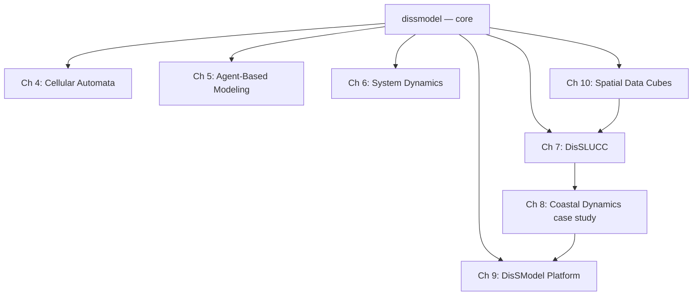

# DisSModel Book

Technical reference guide for the **DisSModel** ecosystem — a Python-native,
FAIR-aligned framework for dynamic spatial modeling, designed as a modern
alternative to **TerraME/LUCCME** (INPE/CCST).

!!! info "Relationship to the textbook"
    This book is the **technical reference** for the ecosystem: installation,
    API, architecture, migration guide. For the didactic material on
    geographic data science in Python — from scratch up to DisSModel — see
    [*Geospatial Modeling with Python*](https://lambdageo.github.io/geospatial-modeling-python/).

## How to use this book

- **Already know TerraME and want to migrate?** Go straight to [Ch. 11 — Migrating from TerraME/LUCCME](part5-reference/ch11_migration.md).
- **Starting from scratch?** Follow Part I in order.
- **Want a specific paradigm** (cellular automata, agents, system dynamics)? Go to Part II.
- **Want to run on production/cluster?** See Part IV.

## Ecosystem map

## Status

This book is under active construction. Chapters marked `TODO` don't have
content yet — the complete skeleton already reflects the planned final
structure.
