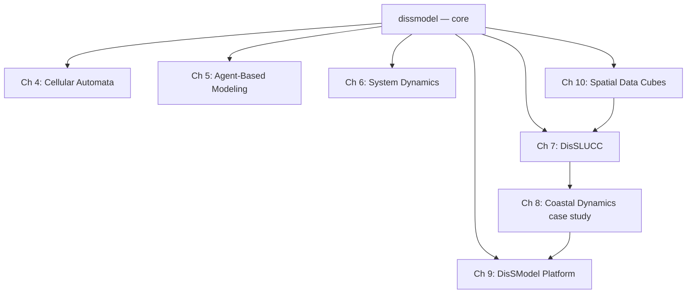

# DisSModel Book

Technical reference guide for the **DisSModel** ecosystem — a Python-native,
FAIR-aligned framework for dynamic spatial modeling, designed as a modern
alternative to **TerraME/LUCCME** (INPE/CCST).

!!! info "Relationship to the textbook"
    This book is the **technical reference** for the ecosystem: installation,
    API, architecture, migration guide. For the didactic material on
    geographic data science in Python — from scratch up to DisSModel — see
    [*Geospatial Modeling with Python*](https://lambdageo.github.io/geospatial-modeling-python/).

## How to use this book

- **Already know TerraME and want to migrate?** Go straight to [Ch. 11 — Migrating from TerraME/LUCCME](part5-reference/ch11_migration.md).
- **Starting from scratch?** Follow Part I in order.
- **Want a specific paradigm** (cellular automata, agents, system dynamics)? Go to Part II.
- **Want to run on production/cluster?** See Part IV.
- **Need a class/function reference while coding?** See [Part VI — API Reference](part6-api/ch13_api_reference.md).
- **Coming from the TerraME course and want a lesson-by-lesson, side-by-side comparison** (real Lua code
  next to real Python code, model by model)? See [Part VII — TerraME Compatibility Course](part7-course/index.md).

## Ecosystem map

```mermaid
graph TD
    A[dissmodel — core] --> B[Ch 4: Cellular Automata]
    A --> C[Ch 5: Agent-Based Modeling]
    A --> D[Ch 6: System Dynamics]
    A --> E[Ch 7: DisSLUCC]
    A --> G[Ch 10: Spatial Data Cubes]
    G --> E
    E --> H[Ch 8: Coastal Dynamics case study]
    A --> I[Ch 9: DisSModel Platform]
    H --> I
```

## Book structure

| Part | Content |
|---|---|
| I — DisSModel Core | why it exists, core concepts, installation |
| II — Simulation Paradigms | System Dynamics, Cellular Automata, Agent-Based Modeling |
| III — Domain Modeling | Land Use & Cover Change, coastal dynamics case study |
| IV — Data & Infrastructure | execution platform, spatial data cubes |
| V — Migration & Reference | migrating from TerraME/LUCCME, architecture & contributing |
| VI — API Reference | module-by-module class/function reference |
| VII — TerraME Compatibility Course | 15 lessons, theory + side-by-side TerraME↔DisSModel code |

## Status

This book is under active construction. Chapters marked `TODO` don't have
content yet — the complete skeleton already reflects the planned final
structure.
